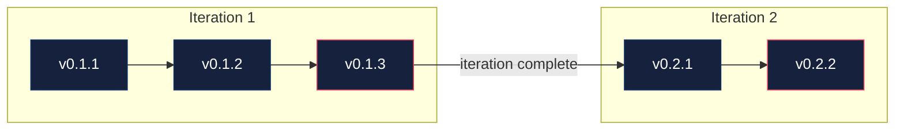

```
  ____ ___ ____
 / ___|_ _/ ___|
| |  _ | | |  _
| |_| || | |_| |
 \____|___\____|
```

A structured workflow system for [Claude Code](https://docs.anthropic.com/en/docs/claude-code).
Gather. Implement. Govern. Zero decision fatigue.

## Quick start

```bash
# Install
git clone https://github.com/gregrossdev/gig.git && cd gig && ./install.sh

# Then in any project:
cd your-project
```

```
/gig:init       →  scaffolds .gig/, discovers your stack, proposes first milestone
/gig:gather     →  researches, makes decisions, builds the plan
/gig:implement  →  executes batches with checkpoints
/gig:govern     →  validates, tracks issues, archives iteration
```

That's it. Repeat `gather → implement → govern` for each iteration.

## What actually happens

### `/gig:gather` — Claude does the thinking

You say what you want. Claude researches your codebase, makes every decision, and presents them for approval:

```
┌─────────────────────────────────────────────────────────┐
│ Does this batch look good?                              │
│                                                         │
│ | ID    | Decision        | Choice          |           │
│ |-------|-----------------|-----------------|           │
│ | D-1.1 | Database        | SQLite + Drizzle|           │
│ | D-1.2 | API pattern     | REST with Hono  |           │
│ | D-1.3 | Auth            | Better Auth     |           │
│ | D-1.4 | Validation      | Zod schemas     |           │
│                                                         │
│ → "approve" / "D-1.2: use tRPC instead" / "no"         │
└─────────────────────────────────────────────────────────┘
```

After you approve decisions, Claude builds the plan — small batches, one concern each:

```
| Batch | Version | Title                    | Status  |
|-------|---------|--------------------------|---------|
| 1.1   | 0.1.1   | Database schema & config | pending |
| 1.2   | 0.1.2   | Auth setup               | pending |
| 1.3   | 0.1.3   | API routes               | pending |
| 1.4   | 0.1.4   | Input validation         | pending |
```

You approve again, then run `/gig:implement`.

### `/gig:implement` — Claude does the work

Batches execute one at a time with checkpoints after each:

```
Checkpoint. Batch 1.2 complete — version 0.1.2.

  Auth setup done: Better Auth configured, login/register routes,
  session middleware, protected route wrapper.

  → "next" to continue
  → "fix [thing]" to insert unplanned work
  → "pause" to stop here
```

Independent batches run in parallel using Agent Teams with git worktrees.
Decisions can be revised mid-build if reality disagrees with the plan.

### `/gig:govern` — Claude validates the work

Governance runs tests, checks acceptance criteria, audits decisions, and tracks issues:

```
### Governance Report

Test Results: 24/24 passed
Acceptance Criteria: 4/4 met
Decision Audit: 4/4 match implementation

Issues: 0 blockers, 0 majors

→ "approve" to archive iteration and merge to main
```

Blockers and majors loop back to implement. Minor issues defer to future iterations.
After approval, the iteration archives to `.gig/iterations/` and govern suggests what's next.

## The only question Claude asks

> "Does this batch look good?"
>
> **"yes"** → Claude executes  |  **"change X"** → Claude adjusts  |  **"no"** → Claude re-evaluates

## Install

**Plugin:**
```bash
/plugin install gig
```

**Shell script:**
```bash
git clone https://github.com/gregrossdev/gig.git
cd gig && ./install.sh
```

**Dev mode** (symlinks — repo edits are instantly live):
```bash
./install.sh --symlink
```

**Uninstall:**
```bash
./install.sh --uninstall
```

## Upgrading

Existing projects get upgraded automatically when you run `/gig:init` — it detects an outdated `.gig/` and applies changes silently.

To upgrade manually (e.g., multiple projects at once):

```bash
# Upgrade a project's .gig/ to the current gig version
./upgrade.sh /path/to/project

# Preview what would change
./upgrade.sh /path/to/project --dry-run
```

What it does:
1. Runs terminology migration (if needed)
2. Adds missing template files (e.g., `GOVERNANCE.md`)
3. Sets `.gig/.gig-version` to track the installed version

Safe to run multiple times — idempotent.

## Commands

| Skill | What it does |
|-------|-------------|
| `/gig:init` | Scaffold `.gig/`, discover project context, propose first milestone |
| `/gig:gather` | Research → decisions → plan (two approval gates) |
| `/gig:implement` | Execute batches, checkpoints, parallel when possible |
| `/gig:govern` | Test, validate, track issues, archive iteration |
| `/gig:status` | Where am I? What's next? |
| `/gig:milestone` | Create or complete milestones |
| `/gig:research` | Deep-dive a topic with subagents |
| `/gig:handoff` | Save/restore session context across sessions |

**Natural language shortcuts:**

`next` · `status` · `fix [thing]` · `skip` · `decisions` · `issues` · `history` · `iteration done`

## Hooks

gig ships hooks that auto-register in `~/.claude/settings.json` on install:

| Hook | Event | What it does |
|------|-------|-------------|
| `govern-context-check.sh` | UserPromptSubmit | Estimates context window usage at governance time, suggests `/clear` when near 30% |
| `block-git-add.sh` | PreToolUse | Blocks `git add -A`, `git add .`, `git add --all` — enforces staging by filename |
| `load-gig-state.sh` | SessionStart | Auto-loads `.gig/STATE.md` into Claude's context on session start/resume/clear |
| `check-readme.sh` | UserPromptSubmit | Reminds to update README if user-facing changes shipped without a README update |

Hooks are installed to `~/.claude/hooks/gig/` and require `jq` for settings.json registration.
Uninstall (`./install.sh --uninstall`) cleanly removes all hooks and their settings.json entries.

**Disabling hooks:** Use `./install.sh --no-hooks` to install without hooks. To disable a specific hook after install, remove its entry from `~/.claude/settings.json` under the `hooks` key.

## Versioning

Every batch gets a version. Every iteration gets a tag.



- **PATCH** — increments per executed batch
- **MINOR** — always equals the iteration number
- **MAJOR** — milestone completion (you declare v1.0, never Claude)

## How gig differs

| | gig | GSD | PAUL |
|---|---|---|---|
| **Approach** | Claude decides everything, you approve | Interactive discussion | Interactive planning |
| **Workflow** | gather → implement → govern | discuss → plan → execute → verify | plan → apply → unify |
| **Issue tracking** | Built-in (severity, fix cycles) | External | External |
| **Parallel execution** | Agent Teams + worktrees | Sequential | Sequential |
| **Versioning** | Iteration-based (MAJOR.MINOR.PATCH) | Phase-based | Phase-based |

## What `.gig/` looks like

```
.gig/
├── STATE.md             # Current version, iteration, progress
├── PLAN.md              # Active iteration — batches and acceptance criteria
├── DECISIONS.md         # Why things are the way they are
├── ISSUES.md            # Problems found, tracked by severity
├── GOVERNANCE.md        # Iteration closure report (test results, audit, verdict)
├── ARCHITECTURE.md      # Your stack, structure, patterns
├── ROADMAP.md           # Milestones, iterations, what's next
├── GIT-STRATEGY.md      # Branch/commit/tag conventions
└── iterations/          # Completed iteration archives (full history)
```

## Learn more

See [docs/GETTING-STARTED.md](docs/GETTING-STARTED.md) for a full walkthrough with tips.

## License

[MIT](LICENSE)
