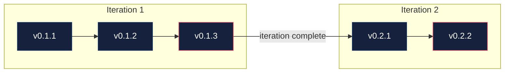

```
  ____ ___ ____
 / ___|_ _/ ___|
| |  _ | | |  _
| |_| || | |_| |
 \____|___\____|
```

A structured workflow system for [Claude Code](https://docs.anthropic.com/en/docs/claude-code).
Gather decisions, implement in batches, govern quality. Two approval gates, zero decision fatigue. It's how I turn AI into reliable, governed output instead of vibe coding.

## How it works

You tell Claude what you want. Claude does the rest — research, decisions, implementation, testing — and checks in with you at two gates before writing any code.

Each iteration is one loop — **decide, build, verify**:

```
/gig:gather     →  decide: research, make decisions, build the plan
/gig:implement  →  build:  execute batches with checkpoints
/gig:govern     →  verify: test, validate, track issues, archive
```

Repeat for the next iteration. That's the whole system.

## Gather — decide what to build

You say what you want. Claude researches your codebase, makes every decision, and presents them in a batch:

```
| ID    | Decision             | Choice                                 | Rationale (1-line)                                    |
|-------|----------------------|----------------------------------------|-------------------------------------------------------|
| D-1.1 | Directory structure  | Split templates into gig/ and project/ | Clean separation — state files vs user-facing output  |
| D-1.2 | Initial templates    | ARTICLE.md, README.md, RESEARCH.md     | Three templates the user requested                    |
| D-1.3 | Copy destination     | Project root, skip if exists           | Respects user customization, not hidden in .gig/      |
| D-1.4 | Selection UX         | Opt-in at init, user picks templates   | Not every project needs an article or research doc    |
| D-1.5 | ARTICLE.md migration | Move out of .gig/ state files          | It was never a state file — clean break               |
| D-1.6 | Upgrade behavior     | upgrade.sh ignores project templates   | Upgrade is for .gig/ state files, not project output  |

Does this batch look good?

→ Approve — reply "approve" or "looks good" to lock these in.
→ Redline — reference by ID (e.g., "D-1.3: copy to docs/ instead").
→ Ask questions — about any decision before committing.
```

After you approve decisions, Claude builds the plan — small batches, one concern each:

```
Iteration 65 — Project Templates (v0.65.x)

| Batch | Version | Title                                    | Status  |
|-------|---------|------------------------------------------|---------|
| 65.1  | 0.65.1  | Restructure templates directory           | pending |
| 65.2  | 0.65.2  | Create README.md and RESEARCH.md templates| pending |
| 65.3  | 0.65.3  | Update init skill for project templates   | pending |
| 65.4  | 0.65.4  | Update tests                              | pending |
```

You approve again, then build.

## Implement — build it batch by batch

Batches execute with auto-continue. Claude reports progress after each:

```
Batch 65.1 done — Restructure templates directory. Continuing...
Batch 65.2 done — Create README.md and RESEARCH.md templates. Continuing...
Batch 65.3 done — Update init skill for project templates. Continuing...
Batch 65.4 done — Update tests. Continuing...

All batches implemented. Run /gig:govern to validate.
```

You can interrupt anytime:
- `fix [thing]` — insert unplanned work as the next batch
- `pause` — save state and stop
- `revise D-1.3` — change a decision mid-build

Independent batches run in parallel using Agent Teams with git worktrees.

## Govern — verify before you ship

Governance runs tests, checks acceptance criteria, audits every decision, and produces a report:

```
Governance Report — Iteration 65

Tests: 212/212 PASS
Acceptance Criteria: 5/5 PASS
Decision Audit: 6/6 match
Issues: 0

Verdict: APPROVED

→ "approve" to archive iteration and merge to main
```

Blockers and majors loop back to build. Minor issues defer to future iterations. After approval, the iteration archives to `.gig/iterations/` and Claude suggests what's next.

## The only question Claude asks

> "Does this batch look good?"
>
> **"yes"** → Claude executes  |  **"change X"** → Claude adjusts  |  **"no"** → Claude re-evaluates

## Install

```bash
git clone https://github.com/gregrossdev/gig.git
cd gig && ./install.sh
```

**Dev mode** (symlinks — repo edits are instantly live):
```bash
./install.sh --symlink
```

**Uninstall:**
```bash
./install.sh --uninstall
```

## Upgrading

Existing projects get upgraded automatically when you run `/gig:init` — it detects an outdated `.gig/` and applies changes silently.

To upgrade manually (e.g., multiple projects at once):

```bash
# Upgrade a project's .gig/ to the current gig version
./upgrade.sh /path/to/project

# Preview what would change
./upgrade.sh /path/to/project --dry-run
```

What it does:
1. Runs terminology migration (if needed)
2. Adds missing template files (e.g., `GOVERNANCE.md`)
3. Sets `.gig/.gig-version` to track the installed version

Safe to run multiple times — idempotent.

## Commands

| Skill | What it does |
|-------|-------------|
| `/gig:init` | Scaffold `.gig/`, discover project context, propose first milestone |
| `/gig:gather` | Research → decisions → plan (two approval gates) |
| `/gig:implement` | Execute batches, checkpoints, parallel when possible |
| `/gig:govern` | Test, validate, track issues, archive iteration |
| `/gig:status` | Where am I? What's next? |
| `/gig:milestone` | Create or complete milestones |
| `/gig:research` | Deep-dive a topic with subagents |
| `/gig:handoff` | Save/restore session context across sessions |

**Natural language shortcuts:**

`next` · `status` · `fix [thing]` · `skip` · `decisions` · `issues` · `history` · `iteration done`

## Hooks

gig ships hooks that auto-register in `~/.claude/settings.json` on install:

| Hook | Event | What it does |
|------|-------|-------------|
| `govern-context-check.sh` | UserPromptSubmit | Estimates context window usage at governance time, suggests `/clear` when near 30% |
| `block-git-add.sh` | PreToolUse | Blocks `git add -A`, `git add .`, `git add --all` — enforces staging by filename |
| `load-gig-state.sh` | SessionStart | Auto-loads `.gig/STATE.md` into Claude's context on session start/resume/clear |
| `check-readme.sh` | UserPromptSubmit | Reminds to update README if user-facing changes shipped without a README update |

Hooks are installed to `~/.claude/hooks/gig/` and require `jq` for settings.json registration.
Uninstall (`./install.sh --uninstall`) cleanly removes all hooks and their settings.json entries.

**Disabling hooks:** Use `./install.sh --no-hooks` to install without hooks. To disable a specific hook after install, remove its entry from `~/.claude/settings.json` under the `hooks` key.

## Versioning

Every batch gets a version. Every iteration gets a tag.



- **PATCH** — increments per executed batch
- **MINOR** — always equals the iteration number
- **MAJOR** — milestone completion (you declare v1.0, never Claude)

## What `.gig/` looks like

```
.gig/
├── STATE.md             # Current version, iteration, progress
├── PLAN.md              # Active iteration — batches and acceptance criteria
├── DECISIONS.md         # Why things are the way they are
├── ISSUES.md            # Problems found, tracked by severity
├── GOVERNANCE.md        # Iteration closure report (test results, audit, verdict)
├── ARCHITECTURE.md      # Your stack, structure, patterns
├── ROADMAP.md           # Milestones, iterations, what's next
├── FUTURE.md            # Backlog ideas — no commitment, no priority
├── GIT-STRATEGY.md      # Branch/commit/tag conventions
└── iterations/          # Completed iteration archives (full history)
```

## Learn more

See [docs/GETTING-STARTED.md](docs/GETTING-STARTED.md) for a full walkthrough with tips.

## License

[MIT](LICENSE)
