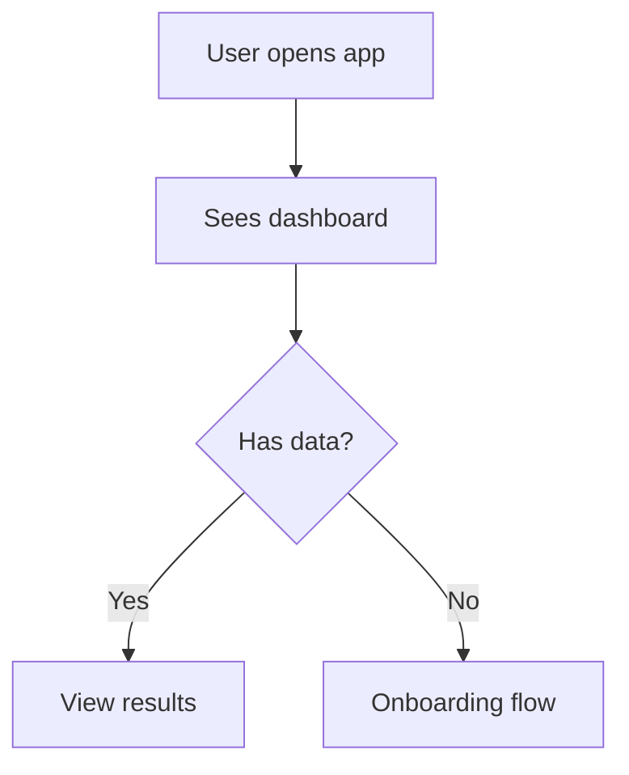
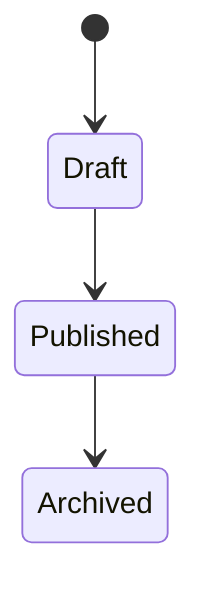

# MVP

> Product discovery document. Generated by the MVP interview during `/gig:init mvp` or `/gig:spec mvp`.
> This captures your product vision, flows, screens, and data model before any code is written.

## Vision

<!-- Elevator pitch, target users, problem statement -->

**Product:** 
**Target Users:** 
**Problem:** 
**What exists today:** 

## Inspiration

<!-- Comparable products, what to borrow, what to avoid -->

| Product | Borrow | Avoid |
|---------|--------|-------|

## Core Flows

<!-- User journey maps as Mermaid flowcharts. One per key flow. Role-annotated if multiple user types. -->

<!-- Example:

-->

## Screens

<!-- Screen inventory with layout descriptions and ASCII mockups -->

<!-- Example:
| Screen | Purpose | Users |
|--------|---------|-------|

### Screen Name
Description of what's on this screen.

┌─────────────────────────────┐
│ Header                      │
├─────────────────────────────┤
│ Content area                │
└─────────────────────────────┘
-->

## Data Model

<!-- Entities, relationships, and state diagrams -->

<!-- Example:
| Entity | Key Attributes | Relationships |
|--------|---------------|---------------|

-->

## Success Metrics

<!-- How will you know the MVP is working? Measurable or observable outcomes. -->

## Open Questions

<!-- Unresolved items flagged during the MVP interview. Surface these during /gig:spec. -->

## Boundaries & Constraints

<!-- What's explicitly NOT in the MVP. Technical constraints, stack decisions. -->

### Out of Scope

### Technical Constraints
